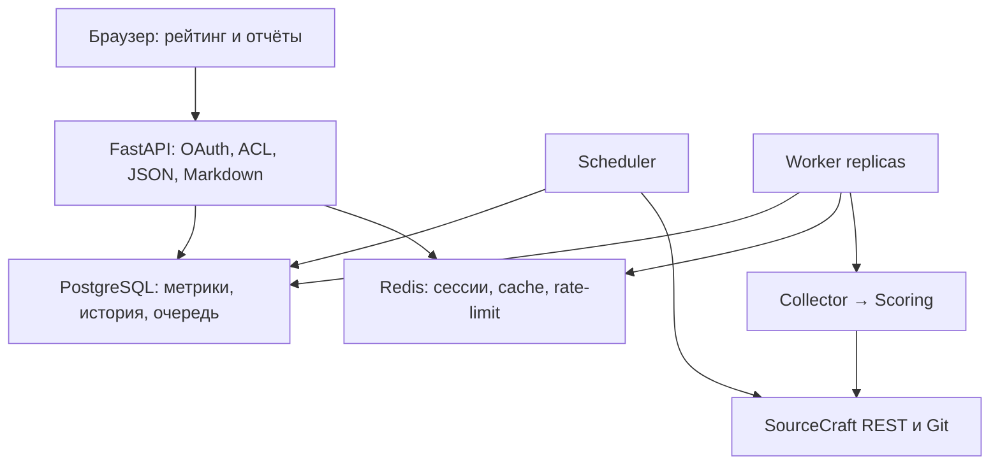
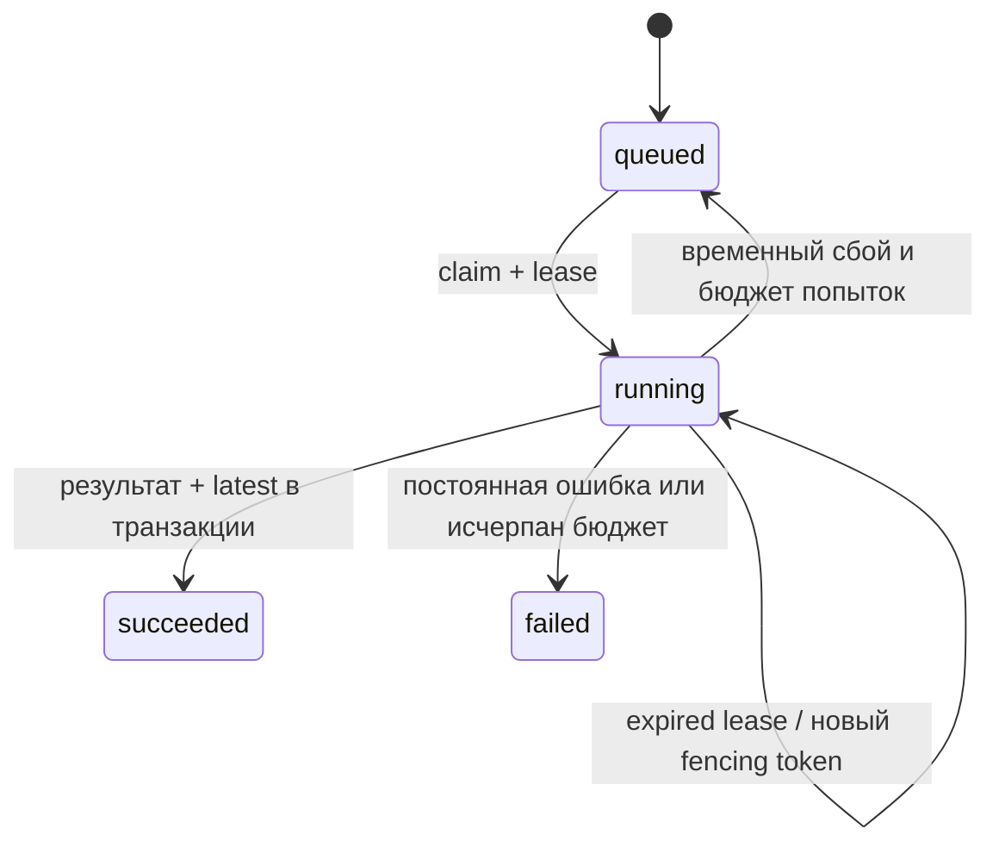

# Архитектура

> Обновление интеграций v2: [актуальные изменения, установка и ограничения](../UPDATE.md). Разделы ниже описывают исходную поставку v1; утверждения об отсутствии общего каталога и Security API заменены документом обновления. Исторические проверки и отчёты v1 сохранены.

## Слои и процессы

API обслуживает UI из локальных статических ресурсов; CORS не включён, внешних CDN нет. Раздельных frontend build-зависимостей нет. FastAPI позволяет документировать публичные API в OpenAPI. SQLAlchemy поддерживает Postgres в Compose, SQLite только для локальных тестов. Redis не является хранилищем очереди: очередь транзакционная в PostgreSQL, чтобы постановка задачи не терялась между commit SQL и Redis.

## Хранение

- accounts: Я ID subject и display_name; PAT зашифрован Fernet. Access token Я ID используется только для получения профиля и не сохраняется.
- repositories: slug и scope. Scope `public` и каждый Я ID — отдельные записи, даже для одинакового SourceCraft repo.
- analyses: immutable results, нормализованные входы, факты, SHA-256 и время.
- jobs: состояние, число попыток, lease, fencing token, безопасный код ошибки.
- schema_version: проверка версии схемы. Начальная миграция под advisory lock.

Пользовательский analysis не становится публичным автоматически. Публичный worker проверяет `visibility=public`, фильтрует приватные issues. Перед просмотром, экспортом и статусом личной задачи сервер обращается к SourceCraft с токеном именно владельца. Отзыв доступа делает старый отчёт недоступным. До завершения уже запущенной задачи данные могут оставаться в памяти worker; чтение всё равно требует свежих прав. Отключение PAT блокирует новые чтения и последующие запуски.

## Жизненный цикл задания

`SELECT FOR UPDATE SKIP LOCKED` позволяет нескольким worker работать независимо. Lease 120 секунд, heartbeat каждые 20 секунд. Старый worker после повторного захвата не может записать результат: его fencing token не совпадает. Не более 4 попыток задания. Сбой API 429/5xx/timeout сначала повторяется адаптером до 4 попыток с backoff+jitter; затем повторяется задача через 30×2^attempt секунд, максимум 3600. 401/403/404 постоянные, автоматического бесконечного ретрая нет. Старая удачная оценка остаётся доступной с исходной датой, новый job показывает сбой.

Worker сейчас выполняет одно задание за раз. Git ограничен 600 секундами; полного общего deadline для всех REST-подзапросов пока нет. При масштабировании добавьте общий job deadline и лимит source budget, не превращая превышение бюджета в отрицательный Score.

## Расписание и рост

Discovery запускается ежедневно для всех настроенных организаций, включая все страницы. Новый репозиторий ставится в очередь. Активные обновляются раз в сутки; последний last_updated старше 180 дней — раз в неделю. Это уменьшает нагрузку на стабильные архивные проекты. Один цикл scheduler каждые 5 минут, Redis lock защищает discovery. Lease lock рассчитан на час; обход дольше часа требует продления lock/разбиения discovery по организациям.

`docker compose up -d --scale worker=3` даёт горизонтальное масштабирование анализаторов. Общий rate-limit 2 запроса/сек на credential не умножается с числом worker. Индексы scope+slug, repo_id и state поддерживают очередь и lookup. Leaderboard фильтрует, сортирует и пагинирует в SQL; перед выдачей каждой строки перепроверяет публичность. На больших каталогах проверки внешних прав становятся задержкой: нужен официально поддерживаемый поток изменения видимости либо отдельная служба ACL, а не безусловное кеширование закрывшихся репозиториев. Добавление функциональных индексов на language/activity/likes и партиционирование analyses — следующий этап после измерения нагрузки.

История 90 дней с сохранением latest, завершённые jobs 30 дней. Redis cache TTL 300 секунд, отдельный namespace по SHA-256 токена; чувствительные чтения не используют cache. Сессии 8 часов, OAuth state 10 минут, одноразовый GETDEL.

## Большие репозитории

Дерево API — поток по страницам 100 записей. Git — bare, no-checkout, single branch, запрос `--filter=blob:none`, чтение `ls-tree`, `log`, `cat-file --batch`, blame. На проверенном SourceCraft repo сервер проигнорировал filter: полный bare-clone допускается только в ресурсных пределах. Поэтому filter не считается гарантией экономии диска.

- Рабочая копия не создаётся. Симлинки и submodule не обходятся.
- 1 GiB суммарный бюджет временных Git-файлов, watchdog раз в секунду, 600 секунд.
- 1 MiB максимум на читаемый blob; 256 MiB суммарно чтения исходников/README.
- Поток истории не ограничен 20 000 коммитами; окно содержательной активности 90 дней.
- Дерево не ограничено 10 000 файлами; память не содержит полный код.
- Blame максимум 50 файлов с TODO. При недоступном полном измерении — `null`, без экстраполяции.
- Временные файлы удаляются после задачи; при аварии процесса — после пересоздания контейнера с tmpfs. Нельзя обещать удаление сразу после SIGKILL одного процесса при живом контейнере; операционный cleanup нужен при таком сценарии.

В Docker 2 GiB RAM/worker, tmpfs 1200 MiB; контролируйте RAM host, поскольку tmpfs расходует память. Лимит не гарантирует успешную обработку любого гигантского репозитория, но предотвращает неконтролируемый рост. Проверка 501 MiB в тесте — ресурсный guard, а не full live анализ репозитория 500 MiB.

## Наблюдаемость и безопасность

`/health/live`, `/health/ready`, `/metrics` (число jobs по статусу), scheduler heartbeat, структурированные по полям безопасные сообщения worker. Access-log выключен, чтобы OAuth code/query не попали в журнал. HTTP-клиенты не пишут токены и bodies. OAuth: state + PKCE S256, одноразовое потребление, привязка к HttpOnly cookie браузера. Cookies Secure при HTTPS, SameSite=Lax. Мутации: точный Origin + CSRF token. HTML вставки экранируются; внешние факты только HTTPS и разрешённые SourceCraft hosts.

Git URL конструируется только из валидированного slug и официального `git.sourcecraft.dev`. Никаких пользовательских URL, shell=True, запуска repository CI, package install или исполнения README. PAT для Git передаётся askpass через environment дочернего процесса, не сохраняется в URL/config/файле. Выделенный непривилегированный контейнер снижает риск чтения environment другим процессом; для серьёзного multi-tenant размещения используйте изолированные worker pools и Secret Manager.
